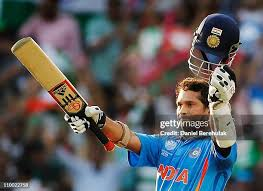
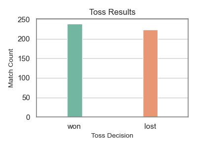

# 🏏 Sachin Tendulkar's ODI Career Analysis

This project is a deep-dive data analysis and visualization of **Sachin Tendulkar's ODI performance**.  
The dataset includes his batting scores, wickets, match conditions, and opposition details across his career.  
Using Python and libraries like **Pandas, Seaborn, Matplotlib, Plotly**, and tools like **BeautifulSoup** and **Requests**, this project aims to extract insights from raw cricket data and present them visually.

---

## 📊 Graphs & Visualizations

### 1. Toss Results

Shows the frequency of toss outcomes.

**Insights**:
- Visualizes how often India won or lost the toss when Sachin played.
- Useful to correlate toss wins with match outcomes later.
---

### 2. Wickets vs Opposition (Box Plot)

Using Plotly for interactive boxplot visualization.

**Insights**:
- Displays the spread and median of wickets taken against each team.
- Helpful to find which teams Sachin performed well against as a part-time bowler.

---

### 3. Toss Results (Donut Chart)

An alternate view of toss outcomes using Plotly.

**Insights**:
- Clear view of proportions of toss wins vs losses.

.png)

---

### 4. Stumps Distribution

Visualizes the number of stumping dismissals.

**Insights**:
- Rarely present — mostly a single bar.
- Highlights that Sachin had few or no stumps in ODIs.

---

### 5. Half Centuries & Centuries

Bar chart showing number of 50s and 100s.

**Insights**:
- Emphasizes consistency.
- Provides a snapshot of milestones across his career.

---

### 6. Dismissals on Zero

Shows how many times Sachin got out on duck.

**Insights**:
- Useful for understanding pressure matches or tough oppositions.

---

### 7. Match Outcomes by Opposition

Crosstab or pivot showing win/loss/tie by teams.

**Insights**:
- Helps identify which teams India had better records against during Sachin's games.

---

## 📋 Tables

### 🗂 Match Outcome Table by Opposition

Shows number of matches won, lost, tied or with no result against each opposition.

| Opposition | Won | Lost | No Result | Tied |
|------------|-----|------|-----------|------|
| Australia  | 20  | 28   | 1         | 0    |
| Pakistan   | 23  | 26   | 2         | 1    |
| England    | 15  | 12   | 1         | 0    |
| ...        | ... | ...  | ...       | ...  |

_📌 This was created using Pandas `pd.crosstab` and `pivot_table`._

---

## 🏁 Conclusion

- Sachin Tendulkar's ODI career is rich with insights across batting, bowling, and match conditions.
- Visualizations helped bring out patterns in performance based on opposition, match results, and conditions.
- Tools like **Seaborn**, **Plotly**, and **Matplotlib** made the data exploration intuitive and appealing.
- This analysis can be extended further into:
  - Venue-based performance
  - Match-winning contributions
  - Comparisons with peers like Dravid, Sehwag, etc.

---

## 🔖 Notes

- All graphs are saved as `.png` files using the **same name as the graph title**, e.g., `toss_results.png`, `Wickets_vs_Opposition.png`, etc.
- All code and notebooks are available in the repo.
