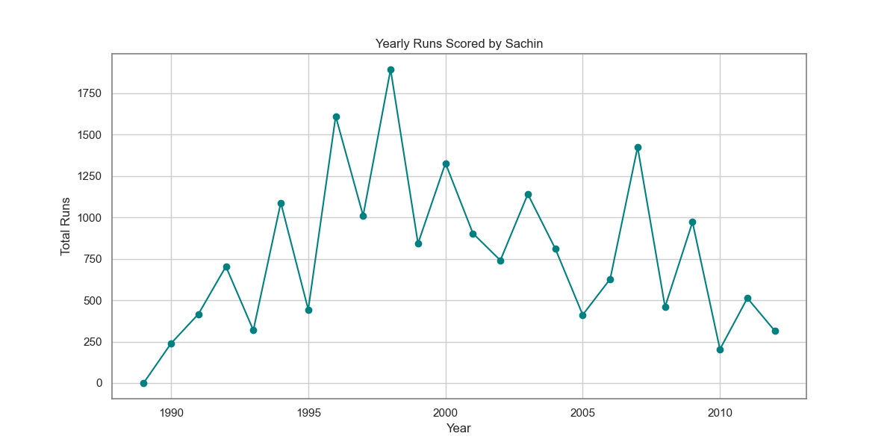
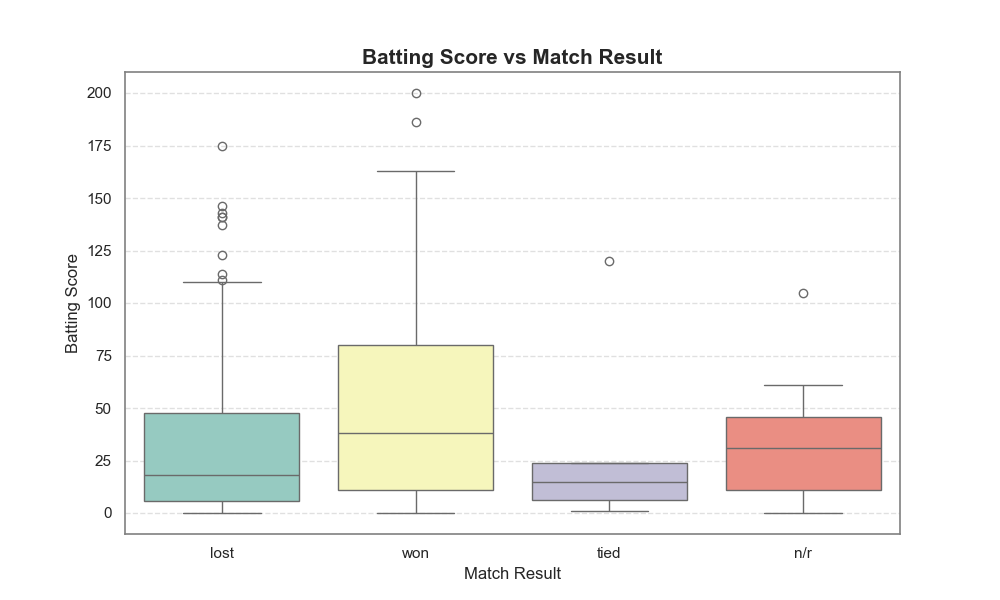
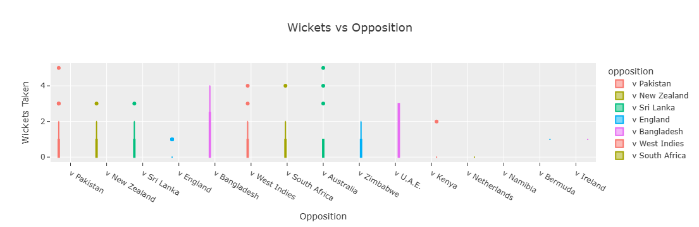
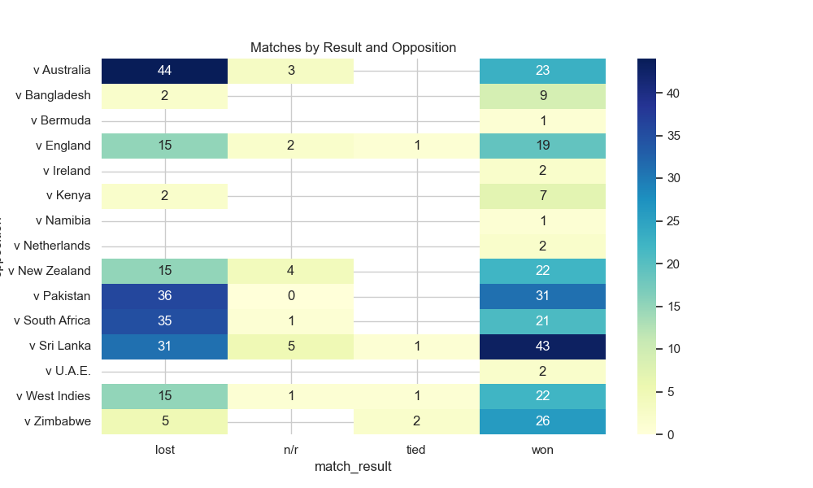

# 🏏 Sachin Tendulkar's ODI Career Analysis

This project is a deep-dive data analysis and visualization of **Sachin Tendulkar's ODI performance**.  
The dataset includes his batting scores, wickets, match conditions, and opposition details across his career.  
Using Python and libraries like **Pandas, Seaborn, Matplotlib, Plotly**, and tools like **BeautifulSoup** and **Requests**, this project aims to extract insights from raw cricket data and present them visually.

---

## 📊 Graphs & Visualizations

###  Distribution of Batting Scores

Shows the frequency of Sachin's scores across all ODI innings.

**Insights**:
- The distribution is **right-skewed**, with most scores falling **under 50 runs**.
- **Scores below 10** are very common, highlighting the challenge of consistency even for greats.
- There are **peaks around 50 and 100**, showing frequent half-centuries and centuries.
- A **sharp decline** is seen after 100, with only a few innings crossing **150+**.
- This plot emphasizes the **rarity of big scores** and the importance of converting starts.

### Count of Centuries and Half-Centuries

Total Centuries: 49  
Total Half Centuries: 96

### Wickets Distribution

Displays the distribution of wickets taken by Sachin Tendulkar in ODI matches.

**Insights**:
- The **median number of wickets** per match is 0, indicating that he didn't bowl in many games or went wicketless.
- The **interquartile range (IQR)** lies between 0 and 2 wickets.
- A few **outliers** are visible, where he took **3 to 5 wickets** — showing occasional standout bowling performances.
- This visual reflects that while bowling wasn’t his primary role, he made key contributions when needed.

### Runs Conceded Distribution

Shows how many runs Sachin Tendulkar conceded in the ODI matches where he bowled.

**Insights**:
- The distribution is **slightly right-skewed**, meaning he more frequently conceded **lower to mid-range runs**.
- Most bowling spells resulted in conceding **between 10 to 35 runs**.
- Very few instances where he gave away **50+ runs**, showing that expensive spells were rare.
- The **peak lies around 20–25 runs**, indicating that his bowling was often economical.
- This visualization supports Sachin’s role as a **part-time bowler** who usually bowled short, tidy spells.

###  Number of Catches per Match

Represents the frequency of matches based on how many catches Sachin Tendulkar took.

**Insights**:
- In the **majority of matches**, Sachin took **no catches** — common for players not constantly fielding in high-catch zones.
- He took **1 catch** in over **100 matches**, showing steady contributions in the field.
- Very few instances of **2 or more catches** in a single game.
- Reflects his **occasional but important role as a fielder**, supporting the team in non-bowling and non-batting capacities.

### Matches Played vs Each Opposition

Bar plot showing the number of ODI matches Sachin Tendulkar played against each opposing team.

**Insights**:
- Sachin played the **most matches against Sri Lanka**, followed by **Australia** and **Pakistan** — key cricketing rivals during his era.
- Regularly featured against **South Africa** and **New Zealand**, showing consistent participation in bilateral series and tournaments.
- Played fewer matches against **associate nations** like Namibia, Bermuda, and UAE.
- This distribution reflects India's **frequent fixtures with top-tier teams**, especially in Asia and ICC events.

### Top 10 Grounds Sachin Played At

Horizontal bar chart displaying the stadiums where Sachin Tendulkar played the most ODI matches.

**Insights**:
- **Sharjah** tops the list with the most number of matches, indicating his dominance in tournaments hosted in the UAE.
- Multiple grounds in **Sri Lanka (Colombo RPS, Colombo SSC)** and **India (Mumbai, Kolkata, Bangalore)** appear in the top 10, showing regional importance.
- Played frequently at **neutral venues** like **Toronto**, highlighting India's participation in international series outside the subcontinent.
- The list represents grounds where he had both iconic performances and consistent appearances.

### Toss Results

**Bar chart** showing the number of matches where the toss was **won** or **lost**.

**Insights**:
- The number of matches where the toss was **won** is slightly higher than those where it was **lost**, suggesting a near-even split.
- This balance indicates that toss outcomes were not heavily skewed during Sachin Tendulkar’s career.
- Given the close numbers, it implies that the **match result or performance wasn’t heavily dependent on toss advantage**.
- The data reflects a large sample size, emphasizing Sachin’s long tenure and participation in a wide variety of match conditions.

### Toss Outcome Breakdown

**Pie chart** displaying the percentage of matches where the toss was won or lost.

.png)

**Insights**:
- The chart shows a nearly **even split between won and lost tosses**, emphasizing that Sachin Tendulkar's matches weren’t significantly biased toward one outcome.
- This balance suggests that **external factors like toss outcomes did not dominate match opportunities** or performance settings.
- It highlights the **consistency and adaptability** of Sachin across different match situations, regardless of the toss result.

### Yearly Performance of Sachin Tendulkar

**Line chart** illustrating the total runs scored by Sachin Tendulkar each year during his international career.

**Insights**:
- The chart highlights **1998** as Sachin's **most prolific year**, with a remarkable peak in total runs scored—reflecting a phase of unmatched form and dominance.
- There are noticeable **spikes in 1996, 1998, and 2007**, indicating comeback years or periods of exceptional performance.
- A **gradual decline after 2002** is evident, signaling the effects of injuries, evolving team roles, and the natural progression of a long career.
- Despite fluctuations, the graph underscores **Sachin's long-term consistency**, with significant contributions spread over more than two decades.

### Batting Score vs Match Result

**Box plot** showing Sachin Tendulkar's distribution of batting scores across different match outcomes: won, lost, tied, and no result (n/r).

**Insights**:
- **Winning matches** tend to have **higher median and upper-range scores**, showing that Sachin’s strong batting performances often contributed to India’s victories.
- Even in **lost matches**, there are several **high outliers** (notably above 150), highlighting Sachin’s efforts despite unfavorable results.
- Matches that were **tied or had no result** generally show **lower medians**, but a few outstanding performances still appear as outliers.
- Overall, the plot emphasizes that **Sachin’s top innings had a greater impact in winning scenarios**, but he was a consistent performer regardless of the final match result.

### Wickets Taken vs Opposition

**Dot and bar plot** showcasing the number of wickets Sachin Tendulkar took against various international teams.

**Insights**:
- Sachin wasn’t just a batting legend—this chart reminds us of his **occasional yet impactful bowling performances**.
- He took the **highest number of wickets against Australia and South Africa**, with several matches showing 3+ wickets, proving effective even against top-tier teams.
- He had notable bowling success against **Bangladesh, Pakistan, and West Indies** too, with several instances of 2 or more wickets.
- Though he bowled less frequently against teams like **England, Namibia, and Bermuda**, he still managed to contribute.
- Overall, the visualization shows that **Sachin was a valuable part-time bowler**, stepping up when needed, especially in crucial matches.

### Matches by Result and Opposition

This **heatmap** visualizes the number of matches played against different opponents, categorized by the result: *won*, *lost*, *tied*, or *no result*.

**Key Takeaways**:

- **Most matches played**: 🆚 **Australia** with a total of **70 matches** (44 lost, 23 won, 3 no result).
- **Best win record**: 🆚 **Sri Lanka** – **43 wins**, compared to 31 losses.
- **Balanced outcomes**: 🆚 **Pakistan** – 36 losses vs 31 wins, a fierce and closely contested rivalry.
- **Consistent wins**: Against **Zimbabwe (26)**, **West Indies (22)**, and **New Zealand (22)**.
- **Minimal losses**: No matches lost to **Namibia**, **U.A.E.**, or **Bermuda**, indicating strong dominance.
- **Tied matches** are rare, with only a handful (vs SL, ZIM, ENG).

🟦 **Darker shades** indicate higher frequency**, giving a quick visual cue to identify performance patterns against each team.

This chart reflects **Sachin's ODI match records** and shows the variation in outcomes depending on the opposition.

## 📋 Tables

### 🗂 Match Outcome Table by Opposition

Top 3 countires with matches won, lost, tied or with no result against each opposition.

| Opposition | Won | Lost | No Result | Tied |
|------------|-----|------|-----------|------|
| Australia  | 20  | 28   | 1         | 0    |
| Pakistan   | 23  | 26   | 2         | 1    |
| England    | 15  | 12   | 1         | 0    |

## 🏁 Conclusion

- Sachin Tendulkar's ODI career is rich with insights across batting, bowling, and match conditions.
- Visualizations helped bring out patterns in performance based on opposition, match results, and conditions.
- Tools like **Seaborn**, **Plotly**, and **Matplotlib** made the data exploration intuitive and appealing.
- This analysis can be extended further into:
  - Venue-based performance
  - Match-winning contributions
  - Comparisons with peers like Dravid, Sehwag, etc.

---
